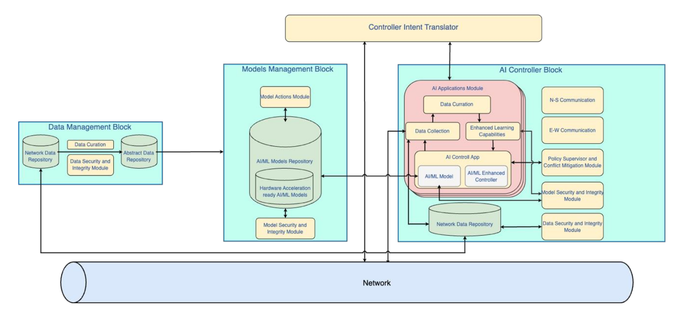

# ModelarDB DMMAI Proof of Concept

Proof of Concept for how to use ModelarDB for data storage in the DMMAI framework.



ModelarDB provides the functionality for ingesting data in multiple AI controllers (AIC), storing it on the AIC,
transferring the stored data to a cloud object store that represents the Data Management Block (DMB), and making the
data available for data curation.

The data can be curated using the ModelarDB Python library and saved in a single file, for example using CSV. The
SLICES Metadata Registry System (MRS) can then be used to store metadata about the curated data and make the datasets
searchable and accessible.

## Running the Proof of Concept

The docker compose file can be started using the following command from the root of this repository:

```bash
docker-compose -p modelardb-cluster -f docker-compose-cluster.yml up
```

This will start the following services:

- `minio-server` - MinIO object storage server.
- `create-bucket` - A one-time job to create the buckets `modelardb` and `datasets` in MinIO.
- `modelardb-edge-1` - ModelarDB edge node representing an AI controller in the DMMAI framework.
- `modelardb-edge-2` - ModelarDB edge node representing another AI controller in the DMMAI framework.
- `modelardb-cloud` - ModelarDB cloud node representing the Data Management Block in the DMMAI framework.
- `modelardb-ingest` - A Rust binary that ingests data into the ModelarDB edge nodes.

When up and running, the ingested data is transferred to the MinIO object store and can be accessed using the MinIO
web interface at `http://localhost:9001` using `minioadmin` as both username and password.

### Data Curation

Data curation can be done using the ModelarDB Python library. An example script is provided in `curate_data/main.py`.
To run the script, first navigate to the `curate_data` folder and install the required dependencies using pip:

```bash
 pip install --no-cache-dir --upgrade --force-reinstall -r requirements.txt
```

It is recommended to install the dependencies in a virtual environment to avoid conflicts with other Python packages.
Note that the `modelardb` Python library is not available on PyPI, so it is installed directly from a Wheel file that
is included in this repository. Once installed, the Python script can be run using the following command:

```bash
python main.py
```

This will connect to the ModelarDB cloud node, execute a query, convert the result to a Pandas DataFrame, and save it
as a CSV file in the MinIO object store. This file can then be registered in the SLICES Metadata Registry System.
